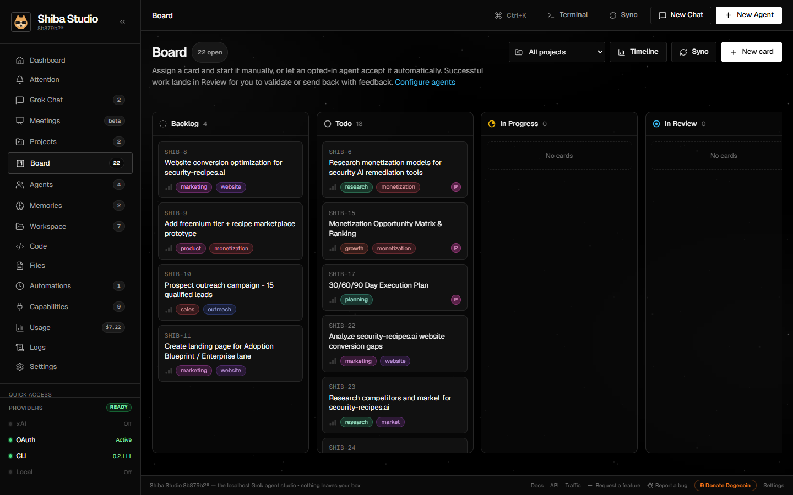
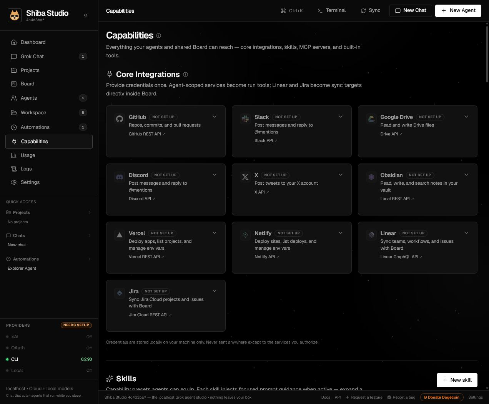
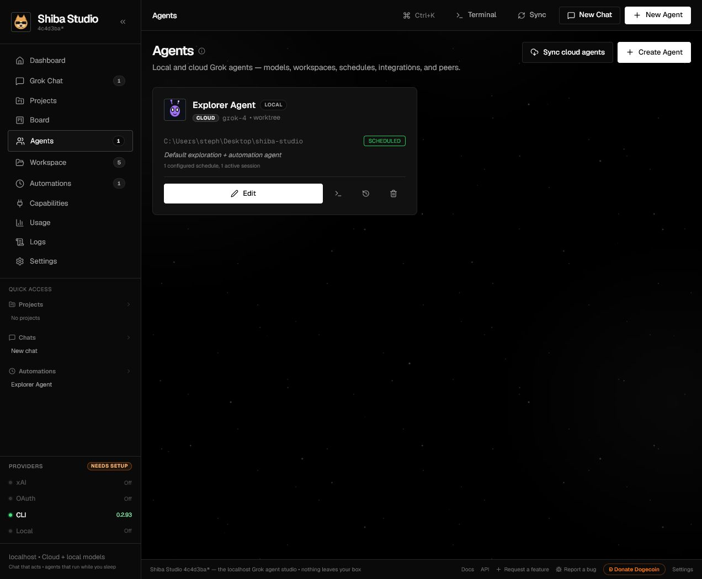
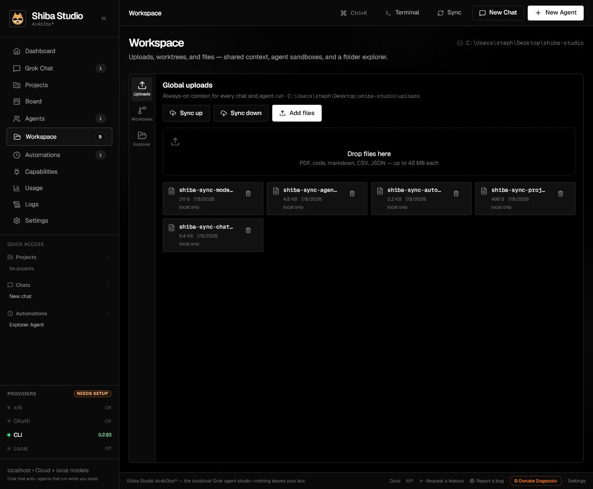
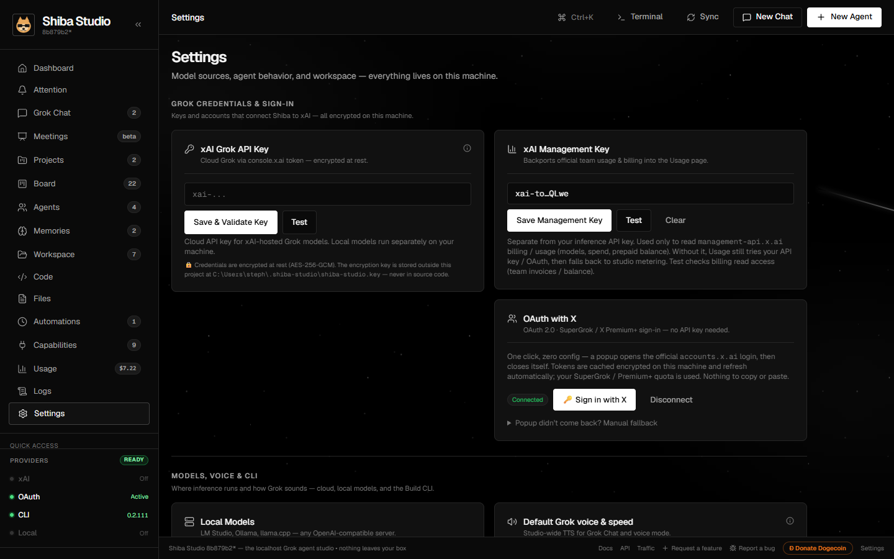

<div align="center">


# Shiba Studio

**The localhost agent studio powered exclusively by Grok / xAI.**

Build, orchestrate, and automate AI agents with full computer use — chat, code, browse, annotate, and ship, all from a beautiful space-themed cockpit that never leaves your machine.

[](LICENSE)
[](COMMERCIAL.md)
[](docs/getting-started.md)
[](docs/getting-started.md)
[](http://shiba-studio.io)

<br/>


*Grok Chat in action — bind a workspace, bring project context into the conversation, dictate messages, and ship from the same session.*

*Upgrading from an older install? Legacy `~/.grokdesk` data (key, credentials, runs, chats) migrates to `~/.shiba-studio` automatically on first start.*

</div>

---

## What is Shiba Studio?

Shiba Studio is a **fully local web application** (Next.js 16) that turns Grok into a hands-on engineering copilot:

- **Dashboard & Attention** — a focused operational home for readiness and recent runs, plus a quiet inbox containing only exact actions that are currently waiting for approval.
- **Artifact Studio** — checkpoint-backed HTML/PDF/Office previews with anchored review, visual verification, rollback, and revocable publishing.
- **Remote and native companions** — a paired, scoped, encrypted-offline PWA for pending approvals and voice requests, and an optional signed Windows helper with per-app, expiring GUI permissions and a visible capture state.

- **Grok Chat** — Claude-Desktop-class chat with streaming reasoning, markdown + syntax highlighting, inline images, multimodal attachments, per-session models, and slash commands that *act* (`/git pr`, `/search`, `/note`, …). Bind any chat to a **workspace folder** (a cloned repo, say) and Grok reads, writes, and searches its files directly.
- **Agents** — autonomous workers with their own model, workspace, git worktree, integration scopes, skills, and peers. Automations select an agent as the execution owner; timing and triggers do not live in agent configuration. Local agents get files, shell, and a controlled Chrome; cloud agents run against Grok cloud services only.
- **Learning & Memories** — agents automatically recall relevant local knowledge before runs and can extract durable facts, decisions, procedures, preferences, and lessons afterward in **Review** or **Automatic** mode. The Memories page provides search, approval, editing, pinning, archiving, scope moves, provenance, and deletion.
- **Automations** — one durable home for recurring schedules, one-time work, webhooks, integration events, filesystem watches, and health checks, with live traces, retry controls, and headless operation.
- **Board** — a shared Kanban where people and agents work the same cards, with optional pull, push, or two-way sync to Linear teams and Jira projects/Kanban boards.
- **Annotation sub-browser** — load the web app *you're* building, click any element DevTools-style, and send its selector + HTML + highlighted screenshot straight into chat for code refinement.
- **Capabilities** — GitHub, Slack, Google Drive, Discord, X, Reddit through a Devvit companion, Obsidian, Vercel, and Netlify agent integrations; Linear/Jira Board sync; custom skills; MCP servers; and a live catalog of 40+ built-in agent tools (web search, workspace grep, persistent memory, image generation, social posting, PRs, deploys, …).
- **Everything local** — Shiba-managed credentials AES-256-GCM encrypted at rest, runs + audit trail in an embedded SQLite database, one-file backup & restore, and zero telemetry. External CLIs can maintain their own permission-restricted caches (the X MCP bridge is documented below).

All intelligence routes exclusively through **Grok/xAI** — cloud API key, OAuth 2.0 with X, the local Grok CLI, or any OpenAI-compatible local model server (LM Studio, Ollama, llama.cpp).

## A look around

| Mission-control dashboard | Automations with run logs |
| :---: | :---: |
|  |  |
| Readiness badges for every model source, live quick stats, and recent runs with one-click answers and full execution traces. | Recurring, one-time, monitored, and event-driven work in one place — active Automations keep running headless while the server is up. |

| Shared Board | Capabilities |
| :---: | :---: |
|  |  |
| A shared Kanban for people and agents, with Board-scoped Linear/Jira pull, push, and two-way sync. | Every integration the studio can reach, plus skills, MCP servers, and the built-in agent tool catalog. |

| Agents | Workspace |
| :---: | :---: |
|  |  |
| Local and cloud execution owners with their own model, workspace, worktree, integration scopes, skills, and peers. | Local files, uploads, and cloud workspace context in one place. |

| Interactive API explorer | Settings |
| :---: | :---: |
|  |  |
| Send real same-origin requests against your instance from `/api-docs` — GET is safe, POST warns first. | Model sources, ask-before-act default, cost & safety guardrails, and one-file backup/restore. |

## Quick start

```bash
git clone https://github.com/stevologic/shiba-studio.git
cd shiba-studio
npm install
npm run dev          # → http://127.0.0.1:3000 (localhost only, by design)
```

Also reachable by name at **http://shiba.local** — the app advertises that name over mDNS and a port-80 redirect forwards bare `shiba.local` to the app port (so **http://shiba.local:3000** works too, and is the fallback if port 80 is taken). `npm run dev:lan` / `start:lan` make the paired Companion/native-node gateway reachable network-wide while keeping the full Studio local (read [SECURITY.md](SECURITY.md) first).

**Requirements:** Node.js ≥ 22.5 (the runs/audit database uses Node's built-in `node:sqlite` — nothing to compile on any platform). Runs on **Windows, macOS, and Linux**.

In LAN mode, network peers reach only the authenticated Companion/native-node gateway; the full Studio stays on an internal loopback listener. See [Security](SECURITY.md) before enabling it.

Then open **Settings** and connect a model source (any one works):

| Source | How |
| --- | --- |
| **xAI API key** | Paste your `xai-…` key from [console.x.ai](https://console.x.ai) → *Save & Validate* |
| **OAuth 2.0 with X** | *Sign in with X* → a popup opens `accounts.x.ai`, then closes itself — tokens cached & auto-refreshed, nothing to paste |
| **Grok CLI** | Install the `grok` CLI — detected automatically from PATH |
| **Local models** | Enable local models and point at any OpenAI-compatible server |

The top bar shows a readiness badge for each source.

## Documentation

| Guide | Covers |
| --- | --- |
| [Getting Started](docs/getting-started.md) | Install on Windows/macOS/Linux, first run, connecting model sources |
| [Grok Chat](docs/chat.md) | Sessions, models & reasoning, attachments, slash commands, the annotation sub-browser, quotas |
| [Board](docs/board.md) | Shared Kanban, agent-run cards, and pull/push/two-way Linear or Jira sync |
| [Agents](docs/agents.md) | Local vs cloud agents, workspaces & worktrees, skills, peers, run history |
| [Memories](docs/memories.md) | Automatic learning modes, relevance recall, review queue, scopes, safety, and management |
| [Automations](docs/automations.md) | Recurring, one-time, monitored, and event triggers; traces, retries, and headless operation |
| [Capabilities](docs/capabilities.md) | Integrations, skills, MCP servers, and the full built-in tool catalog |
| [Context Engine](docs/context-engine.md) | Bounded replay, deterministic compaction, citations, pinning, search, forks, and ephemeral chats |
| [Capability Packs](docs/capability-packs.md) | Governed learn → review → activate workflow packs, permissions, versions, rollback, and uninstall |
| [Artifact Studio](docs/artifact-studio.md) | Immutable previews, visual evidence, annotations, live refresh, rollback, and publishing |
| [Native Nodes](docs/native-nodes.md) | Signed Windows-helper protocol and compatibility API for existing paired nodes |
| [Grok CLI](docs/cli.md) | Routing chat through the local `grok` CLI, the `grok_cli` agent tool, effort/check/best-of-N/structured output |
| [API Reference](docs/api.md) | Every `/api/*` endpoint, curl examples, and the in-app interactive explorer at `/api-docs` |
| [Cloud Sync](docs/sync.md) | What sync does, where snapshots live, push/pull semantics |
| [Architecture](docs/architecture.md) | How every feature fits together — one diagram, one engine |
| [Configuration](docs/configuration.md) | Settings reference, environment variables, data locations, security model |
| [Development](docs/development.md) | Repo layout, scripts, the verification suite, architecture notes |

## Highlights

- **Slash commands with grouped autocomplete** — type `/` in chat for session targeting (`/agent`, `/model`, `/project`, `/clear`), Board work (`/task`, `/board`), Git (`/git status|diff|log|checkout|commit|pull|push|pr`), research, memory lifecycle (`/remember`, `/recall`, `/forget`, `/memories`), publishing, and `/help`.
- **Chat workspaces** — point a chat at any folder with `/workspace` (or the topbar folder button); file reads/writes/searches and `/git` commands run inside it, so "fix the failing test in this repo" just works.
- **Auto-titled chats** — a low-end model summarizes each new conversation into a title after the first exchange.
- **Run provenance everywhere** — dashboard runs, agent history, Automation history, and the audit log all deep-link to full execution traces; removing an execution owner safely retires its Automations while preserving history.
- **Cost & safety guardrails** — monthly *and* daily spend limits with an optional hard stop, a global concurrent-run cap, per-run token caps, and overlap-suppressed Automation invocations (Settings → Cost & safety).
- **Global search** — Ctrl+K searches chats, memories, agent runs, and the audit log alongside commands, deep-linking straight to the result.
- **Backup & restore** — export your entire studio (settings, agents, chats, projects, runs, audit log) to one file and restore it on another machine.
- **Bounded Board sync** — mirror task fields and optional workflow status with Linear or Jira while keeping stable `SHIB-#` keys; ordering, assignees, activity, runs, sprints, and deletions stay out of sync.
- **Cross-session agent learning** — scoped SQLite memories are relevance-ranked and injected automatically; successful runs can propose or activate safe learned memories with provenance and manual-review controls.
- **Grok CLI deep integration** — route chats through the local CLI, and give agents `grok_cli` with effort levels, self-verification, best-of-N, and structured JSON output.

## Security

- **Scoped LAN gateway** — `dev:lan` / `start:lan` keep Next on an internal loopback listener and classify the real socket peer at the gateway, so a forged `Host: localhost` cannot expose generic Studio APIs. Remote clients reach only paired Companion/native-node routes.

- **Localhost only, by default** — the server binds `127.0.0.1`; a same-origin guard (`proxy.ts`) blocks any other website in your browser from reaching the API, and the terminal bridge rejects foreign WebSocket origins. `npm run dev:lan` / `start:lan` opt into LAN exposure.
- **Ask-before-act** — sensitive tools (shell, file writes, posting) require per-call approval by default; YOLO mode is an explicit opt-in.
- **Spend limits** — optional monthly/daily budgets with a hard stop pause cloud runs and chats before you overspend; local models are always free.
- **Credentials at rest** — Shiba-managed secrets (xAI API key, Shiba OAuth tokens, integration secrets) are **encrypted with AES-256-GCM** before touching Shiba's stores; the machine key lives outside the project at `~/.shiba-studio/shiba-studio.key` (or supply `SHIBA_SECRET_KEY` as 64 hex chars for headless deployments). Plaintext Shiba stores migrate to encrypted form automatically on first load. External tools can have separate storage policies; notably, official `xurl` keeps the X MCP token cache in a permission-restricted plaintext YAML file inside Shiba's isolated data directory.

Full threat model and vulnerability reporting: [SECURITY.md](SECURITY.md) · Privacy: [PRIVACY.md](PRIVACY.md) · Settings reference: [Configuration](docs/configuration.md).

## Commands

| Command | What it does |
| --- | --- |
| `npm run dev` | Development server with hot reload (binds `127.0.0.1`) |
| `npm run build` | Production build |
| `npm run start` | Serve the production build (binds `127.0.0.1`) |
| `npm run dev:lan` / `start:lan` | Explicitly expose on all interfaces — read [SECURITY.md](SECURITY.md) first |
| `npm test` | Full functional verification suite — isolated, never touches your live data |
| `npm run test:e2e` | Playwright browser E2E (run `npx playwright install chromium` + `npm run build` first) |

## Contributing & support

- 🌐 **Website & docs** → [shiba-studio.io](http://shiba-studio.io)
- 🛠️ **Contributing guide** → [CONTRIBUTING.md](CONTRIBUTING.md) · [Code of Conduct](CODE_OF_CONDUCT.md)
- 🐛 **Bugs / feature requests** → [open an issue](https://github.com/stevologic/shiba-studio/issues/new/choose)
- 🔒 **Security reports** → [SECURITY.md](SECURITY.md) (privately, please)
- 🗺️ **Roadmap to public release** → [TODO.md](TODO.md)
- Ð **Donate Dogecoin** → `DTW2M5oEW97WbmYJRM71qD7uE6xfJs1MUK` (much thanks, very wow)

## License

**Dual licensed:**

- **[AGPL-3.0-or-later](LICENSE)** — open source; if you run a modified version as a network service, you must offer source to users.
- **[Commercial](COMMERCIAL.md)** — for closed-source / SaaS use without AGPL obligations (contact the copyright holder).

The public repository is distributed under AGPL-3.0-or-later unless a separate commercial agreement is in force.
