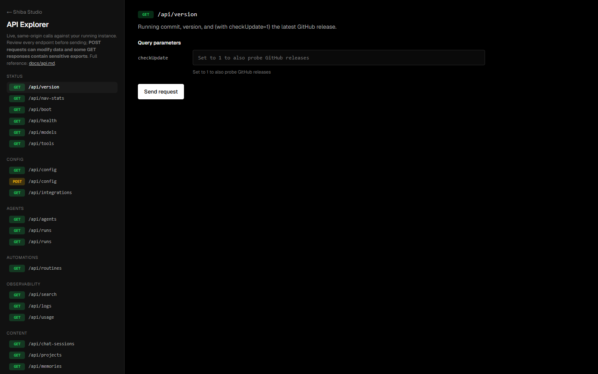

# API Reference

Shiba Studio is driven entirely by its own local HTTP API (Next.js route
handlers under `app/api/*`). Everything the UI does — listing agents, streaming
runs, saving config — is a call you can make yourself.

> **Try it live.** Open **[http://127.0.0.1:3000/api-docs](http://127.0.0.1:3000/api-docs)**
> while the app is running for an **interactive explorer** that sends real
> requests against your instance and shows the responses. (It must be served
> from the app's own origin — see Access & security below.)



## Access & security

- **Base URL:** `http://127.0.0.1:3000` (whatever host/port you run on).
- **Same-origin only.** `proxy.ts` first validates that the destination Host is
  owned by this Studio (loopback, a configured mDNS alias, or a local interface
  IP), then requires an exact scheme/host/port `Origin`. Cross-site navigations
  are also rejected. Calls from `curl`/scripts (no `Origin` header) and from the
  app's own pages are allowed. This is why the interactive explorer lives
  inside the app rather than on the docs site.
- **Local API has no auth token.** The full API is single-user and localhost
  only. In `dev:lan` / `start:lan`, network clients are restricted to the
  paired Companion API and the signed native-node protocol. Their data/action
  handlers require separate scoped bearer keys; administration and captures
  remain localhost-only. Do not manually bind the full app beyond localhost
  outside that supported mode.
- **Trusted-LAN Studio is explicit.** `dev:lan:studio` / `start:lan:studio`
  grant this unauthenticated full API to private-network socket peers through
  the classified gateway. Same-origin checks prevent browser drive-by requests,
  but every peer that can directly reach the port has the host user's Studio
  powers. Use only where every LAN/VPN peer is trusted.
- **Responses are JSON** unless noted (streams are SSE; backup is a file
  download). Most return `{ ok: true, ... }`; errors return a non-2xx status
  with `{ error }` or `{ ok: false, error }`.

### curl example

```bash
curl -s http://127.0.0.1:3000/api/version | jq
curl -s "http://127.0.0.1:3000/api/runs?limit=5" | jq
curl -s -X POST http://127.0.0.1:3000/api/config \
  -H 'Content-Type: application/json' \
  -d '{"dailyBudgetUsd": 10}'
```

## Endpoints

### Status & metadata

| Method | Path | Purpose |
| --- | --- | --- |
| GET | `/api/version` | Running commit/version. `?checkUpdate=1` also probes GitHub releases (cached 6 h). |
| GET | `/api/boot` | Boot ping — hydrates config and ensures the single process-global Automation engine is running (idempotent; carries the live commit). |
| GET | `/api/health` | Lightweight liveness probe with no startup or Automation-engine side effects. |
| GET | `/api/nav-stats` | Sidebar counts: chats, projects, workspace files, active Automations, integrations, usage cost, `cloudReachable`. |
| GET | `/api/models` | Selectable models (cloud + local) and cloud-auth flags. |
| GET | `/api/tools` | The full built-in tool catalog with groups and scope requirements. |

### Configuration

| Method | Path | Purpose |
| --- | --- | --- |
| GET | `/api/config` | Settings with secrets masked, auth flags, secret-key location. |
| POST | `/api/config` | Update settings. Body is a partial config, e.g. `{ "usageBudgetUsd": 50 }`, `{ "toolApprovalMode": "ask" }`, `{ "dailyBudgetUsd": 10, "budgetHardStop": true }`, `{ "action": "testLocalGrok", "localGrokBaseUrl": "…" }`. |
| GET | `/api/integrations` | Configured integration credentials with secret fields masked + channel-listener status. |
| POST | `/api/integrations` | `{ action: 'save'\|'delete'\|'test', which, creds }` — save/remove/test one integration. |

### Agents & runs

Agents are execution owners. Trigger and schedule management is available only through the [Automation endpoints](#automations-routine-api).

| Method | Path | Purpose |
| --- | --- | --- |
| GET | `/api/agents` | All execution owners (models, workspaces, scopes, skills, peers). |
| POST | `/api/agents` | `{ action: 'create'\|'update'\|'delete', … }` — manage agents. |
| GET | `/api/memories` | Search/filter memories by `q`, `agentId`, `status`, or `source`; returns stats and scope labels. |
| POST | `/api/memories` | `{ action: 'create'|'update'|'delete'|'clear', … }` — manage, approve, pin, archive, move, or remove memories. |
| GET | `/api/runs` | Run summaries. Filters: `?agentId`, `?scheduleId=<automationId>`, `?scheduledOnly=1`, `?limit`. `?id=<runId>` returns one run **with its full trace**. The `scheduleId` field name is retained for run-record compatibility and carries the Automation id. |
| POST | `/api/execute` | Run an agent once (non-streaming); returns the finished run. |
| POST | `/api/execute/stream` | Run an agent with a live **SSE** trace (`{ agentId, prompt, … }`). |
| POST | `/api/execute/approve` | Approve/deny a pending tool call (`{ approvalId, approved }`). |

### Tasks, evidence, and approvals

| Method | Path | Purpose |
| --- | --- | --- |
| GET/POST | `/api/tasks` | List/create universal durable tasks; supports mode, origin, parent, workspace roots, budgets, and a completion contract. |
| POST | `/api/tasks/recommend` | Recommend Quick chat, Work, Code, or Routine routing without overriding the user. |
| GET/PATCH | `/api/tasks/:id` | Read full task/children/evidence/attention state or update the durable plan/progress fields. |
| POST | `/api/tasks/:id/dispatch` | Dispatch a queued task through the existing agent runtime. |
| POST | `/api/tasks/:id/commands` | Idempotent optimistic pause, resume, steer, cancel, retry, approve, or deny. |
| GET/POST | `/api/tasks/:id/evidence` | Read or record typed, scoped verification evidence. |
| GET/PUT | `/api/tasks/:id/contract` | Read or replace the versioned completion contract. |
| POST | `/api/tasks/:id/verify` | Re-evaluate every contract requirement and transition only when proven. |
| GET/POST | `/api/tasks/:id/checkpoints` | List or capture bounded task-owned checkpoints. |
| GET/POST | `/api/tasks/:id/checkpoints/:checkpointId` | Inspect or restore an exact file/task/chat checkpoint. |
| GET/POST | `/api/tasks/:id/team` | Read or create the bounded specialist dependency graph. |
| POST | `/api/tasks/:id/team/dispatch` | Claim and start all dependency-ready worker tasks. |
| GET | `/api/attention` | List live exact approvals awaiting a decision. Optional query parameters: `taskId`, `limit` (1–500; default 100), and `offset` (non-negative; default 0). Results have a stable newest-first order. |
| PATCH | `/api/attention/:id` | Compatibility guard that returns `409`; approvals must use an exact `approve` or `deny` task command. |

### Automations (Routine API)

The primary Studio surface calls these **Automations**. Every recurring, one-time, webhook, event, filesystem, health-check, and manual definition lives here; there is no separate agent scheduling API. Stable endpoint paths, payloads, and persisted types retain **Routine** terminology for compatibility.

| Method | Path | Purpose |
| --- | --- | --- |
| GET/POST | `/api/routines` | List/create durable manual, scheduled, webhook, event, filesystem, or health-check Routines. |
| GET/PATCH/DELETE | `/api/routines/:id` | Read, version-update, enable/disable, reset a circuit, or remove a Routine. |
| POST | `/api/routines/:id/run` | Trigger a saved Routine manually with idempotency and parameters. |
| POST | `/api/routines/:id/webhook` | Receive a timestamped HMAC-signed, replay-protected webhook delivery. |
| GET | `/api/routines/:id/export` | Export a portable JSON or YAML definition. |

### Board

| Method | Path | Purpose |
| --- | --- | --- |
| GET | `/api/board` | List Board cards; `?id=<id-or-SHIB-key>` returns one card with activity and external issue links. |
| POST | `/api/board` | Board actions: `create`, `update`, `move`, `delete`, or `startWork`. |
| GET | `/api/board/sync` | Linear/Jira connection overview: selected target, direction/mode, linked-card count, and last-sync summary. |
| POST | `/api/board/sync` | Discover targets with `{ action: 'discover', provider }`, or run sync with `{ action: 'sync', provider, targetId, direction, mode, conflictPolicy }`. Providers: `linear|jira`; directions: `pull|push|bidirectional`; modes: `tasks|board`; conflict policies: `newest|local|remote`. |

### Chat

| Method | Path | Purpose |
| --- | --- | --- |
| GET/POST | `/api/chat-sessions` | List / create / update / delete chat sessions. |
| POST | `/api/grok/stream` | Stream a chat turn (SSE) — the main chat endpoint. |
| POST | `/api/grok/multi-agent-stream` | "All agents" group chat with synthesis (SSE). |
| POST | `/api/grok-cli/stream` | Stream a chat turn through a managed, one-shot official Grok Build process (SSE). Shiba launches `grok --no-auto-update -p … --output-format streaming-json` and projects the CLI's NDJSON events into the chat stream. See [CLI](cli.md). |
| GET | `/api/grok-cli/status` | Official Grok Build detection: installed path/version plus authenticated model readiness from `grok models`. `?checkUpdate=1` also checks for a newer released binary. |
| POST | `/api/chat-tools` | Run chat research, memory, and X actions (`search`, `fetch`, `remember`, `recall`, `forget`, `post_x`). Git, Board, and Obsidian commands use their dedicated endpoints. |
| POST | `/api/chat/upload` | Attach files/images to a chat. |
| POST | `/api/tts` | Text-to-speech (xAI voices). |

### Observability

| Method | Path | Purpose |
| --- | --- | --- |
| GET | `/api/search` | Global FTS5 search across chats, runs, and the audit log (`?q=`). |
| GET | `/api/logs` | Audit log, paginated (`?q`, `?category`, `?limit`, `?offset`). |
| GET | `/api/usage` | Usage & cost summary (studio metering + optional xAI billing backport). |
| GET | `/api/doctor` | Machine-readable, secret-free, read-only model/auth, static MCP launch readiness, isolated browser launch health, task/storage, worktree/Git-origin, firewall/LAN-origin boundary, and pack/native-helper compatibility diagnostics. Arbitrary MCP processes start only through their separate explicit Test action. |
| GET/POST | `/api/doctor/repairs` | Compatibility endpoint to preview or apply one exact-confirmed, audited repair. |

The former Doctor page has been removed. These endpoints remain for diagnostics automation and backwards compatibility.

### Context and Companion voice storage

There is no standalone Meetings page. The meeting-named endpoints remain as the storage and transcription layer for consent-confirmed Companion voice requests; durable plain-text transcript citations remain available after retained audio is deleted.

| Method | Path | Purpose |
| --- | --- | --- |
| GET/PATCH | `/api/context/scopes/:scopeType/:scopeId` | Inspect meter/sources/compactions or pin/rebuild one session, project, or run context scope. |
| GET | `/api/context/search` | Bounded grounded source search with exact citations. |
| GET | `/api/context/sources/:sourceId` | Resolve an exact immutable source citation. |
| GET/POST | `/api/meetings` | List meetings or stream a consent-confirmed local microphone/upload recording. |
| GET/PATCH/DELETE | `/api/meetings/:id` | Read/update reviewed transcript metadata, delete retained audio, or delete the meeting. |
| GET | `/api/meetings/:id/audio` | Range-capable local audio playback without exposing a filesystem path. |
| GET | `/api/meetings/:id/citation` | Stable read-only plain-text transcript citation that remains available after audio retention cleanup. |
| POST | `/api/meetings/:id/transcribe` | Start xAI STT diarization with word timestamps. |
| POST | `/api/meetings/:id/outputs` | Compatibility endpoint that creates selected idempotent Board cards/Automations and ledger evidence after exact confirmation. |

### Workspace, projects & files

| Method | Path | Purpose |
| --- | --- | --- |
| GET/POST | `/api/workspace` | List files (`?dir=`); POST `{ action: 'read', path }` or `{ path, content }` to write. |
| GET | `/api/workspace/diff` | Working-tree diff for a workspace. |
| GET/POST | `/api/workspace/worktrees` | List app-managed Git worktrees with authoritative agent/chat consumers, create one only for an agent mapped to that repository, or request safe removal. Removal refuses live, dirty, or unpushed worktrees. |
| POST | `/api/workspace/sync`, `/api/workspace/upload`, `/api/workspace/cloud-file`, `/api/workspace/context` | Global uploads, cloud sync, and context assembly. |
| GET | `/api/fs/browse` | Folder browser — subdirectories of `?dir=` (git repos badged). |
| GET/POST | `/api/projects`, `/api/projects/context`, `/api/projects/upload` | Project CRUD, context, and file uploads. |
| POST | `/api/git` | Git actions (status/checkout/commit/pr) against a workspace. |
| GET | `/api/ide/workspaces` | Workspace-picker options for the configured default workspace, saved project folders, and discovered Git worktrees, including folder availability. |
| GET/POST | `/api/ide/files` | Contained IDE directory listing, text reads/search, conflict-aware saves, create, rename, and delete. |
| GET/POST | `/api/ide/git` | Structured status/branches/history/diffs plus per-file stage, unstage, discard, commit, fetch, pull, push, and branch actions. |
| GET/POST | `/api/ide/github` | GitHub repository activity plus pull-request and issue creation using the configured server-side token. |

### Artifact Studio

| Method | Path | Purpose |
| --- | --- | --- |
| GET/POST | `/api/artifacts` | List task artifacts or register a checkpoint-backed immutable artifact from a task-owned file. |
| GET | `/api/artifacts/:id` | Read an artifact, immutable versions, and anchored annotations. |
| POST | `/api/artifacts/:id/versions` | Capture changed source bytes as a new checkpoint-backed version. |
| GET | `/api/artifacts/:id/versions/:versionId/raw` | Integrity-check and stream one private preview snapshot. |
| POST | `/api/artifacts/:id/versions/:versionId/verify` | Record visual pass/fail evidence in the task ledger. |
| GET/POST/PATCH | `/api/artifacts/:id/annotations` | List, create, resolve, or reopen version-anchored feedback. |
| POST | `/api/artifacts/:id/refresh` | Read an explicitly approved read-only live source into a new version. |
| POST | `/api/artifacts/:id/rollback` | Make an existing immutable version current. |
| GET/POST | `/api/artifacts/:id/publish` | List publications; publish, revoke, or take down a verified version. |
| GET | `/api/artifact-public/:token` | Serve a valid, audience-allowed publication with integrity checks and no caching. |

See [Artifact Studio](artifact-studio.md) for checkpoint, renderer, sandbox, and publishing guarantees.

### Integrations & capabilities

| Method | Path | Purpose |
| --- | --- | --- |
| GET/POST | `/api/obsidian` | Test/list/read/write/search an Obsidian vault. |
| GET/POST | `/api/google-drive/folders` | List Drive folders for per-agent scoping. |
| GET/POST | `/api/skills` | Built-in + custom skills; create/edit/assign. |
| GET/POST | `/api/mcp` | Configured MCP servers; add/enable/remove. |
| GET/POST | `/api/capability-packs` | List/export packs; create inert proposals; activate, reject, rollback, uninstall, or instantiate reviewed Routine templates. |
| GET | `/api/capability-packs/journey` | Combined learned-pack and learned-memory provenance timeline. |
| GET/POST | `/api/subbrowser`, `/api/subbrowser/stream` | The annotation sub-browser (navigate, annotate, screenshot). |
| GET/POST | `/api/terminal` | Studio terminal session info and control. |

### Native companion nodes

| Method | Path | Purpose |
| --- | --- | --- |
| GET/POST | `/api/native-nodes/admin` | Localhost-only node, grant, and recent-job administration. POST creates pairings/grants/jobs or revokes a node/grant. |
| POST | `/api/native-nodes/pair` | Consume a five-minute pairing code and a verified signed-release proof; returns a node key once. HTTPS or loopback. |
| GET | `/api/native-nodes/poll` | Authenticated helper poll for the next HMAC-signed, leased one-shot job. |
| POST | `/api/native-nodes/complete` | Authenticated signed job completion, optional screenshot, accessibility/clipboard text security scan, and audit. |
| POST | `/api/native-nodes/events` | Authenticated signed quick-entry or file-drop event; creates a durable task. |
| GET | `/api/native-nodes/captures/:id` | Localhost-only stored PNG for a completed capture job. |
| GET | `/api/native-nodes/release/:file` | Public signed helper release file. HTTPS or loopback; contains no secret. |

See [Native companion nodes](native-nodes.md) for the signed protocol, escalation ladder, expiring app grants, sensitive-app block, and Windows helper operations.

### Remote companion and external harnesses

| Method | Path | Purpose |
| --- | --- | --- |
| GET/POST | `/api/companion/admin` | Localhost-only remote-access toggle, scoped pairing creation, and device revocation. |
| POST | `/api/companion/pair` | Consume a short-lived pairing code and return one expiring device key once. |
| GET | `/api/companion/status` | Public disabled/enabled and pairing status without task data. |
| GET | `/api/companion/data` | Authenticated redacted tasks/evidence/pending-approval/Routine projection plus sanitized voice-request status for devices with `action:voice`. |
| POST | `/api/companion/actions` | Scoped, revision-bound, idempotent exact approval/deny, steering, cancel, or Routine action. |
| POST | `/api/companion/voice` | Stream one consent-confirmed, SHA-256-bound microphone request from a device with `action:voice`. Supported audio is capped at 50 MB, retained locally for one day, transcribed through server-side xAI auth, and dispatched as a durable task. |
| GET/POST | `/api/harness-grants` | List or issue one-workspace, action-level, TTL-bound attachment grants for an external coding worker. |
| POST | `/api/harness-grants/:id/start` | Activate one grant, create or attach its child task/session contract, and return the attachment metadata. This endpoint does not discover or spawn an ambient host CLI. |
| POST | `/api/harness-grants/:id/callback` | Authenticated external worker status and typed evidence callback. |
| POST | `/api/harness-grants/:id/revoke` | Revoke the grant and cancel its child task. |

External harness grants are callback contracts, not process launchers. The
external worker or operator launches the selected harness and reports status
and evidence with the grant credential. The official Grok Build CLI's own
persistent IDE transport is `grok agent stdio` over ACP; Shiba currently uses
the separate one-shot headless transport for chat and agent delegation. See
[Grok Build harnesses](grok-build-harnesses.md).

### OAuth (browser-driven)

| Method | Path | Purpose |
| --- | --- | --- |
| POST | `/api/xai-oauth/start` | Begin X OAuth (returns the authorize URL). |
| GET | `/api/xai-oauth/callback` | Loopback/manual callback hand-back page. |
| POST | `/api/xai-oauth/exchange` | Exchange the code for tokens. |
| GET | `/api/xai-oauth/status` | OAuth connection status. |
| POST | `/api/xai-oauth/logout` | Disconnect OAuth. |
| GET/POST | `/api/google-oauth/start`, `/api/google-oauth/callback` | Google Drive OAuth. |

Reddit does not expose a browser-OAuth route in Shiba. The server calls the bundled Devvit companion's fixed `/external/shiba/status`, `/external/shiba/posts/read`, and `/external/shiba/posts/submit` routes with a managed app token. See [`devvit/reddit-bridge/README.md`](../devvit/reddit-bridge/README.md) for the deployment contract.

### Backup & sync

| Method | Path | Purpose |
| --- | --- | --- |
| GET | `/api/backup` | Download a full studio backup (JSON incl. encryption key; `?key=omit` to exclude it). |
| POST | `/api/backup` | Restore a backup bundle (posted as the JSON body). |
| GET/POST | `/api/cloud/entities` | List counts/auth state or push/pull entity snapshots. Kinds include `agents`, `automations`, `projects`, `board`, `chats`, `workspace`, and `models`. |

## Streaming (SSE) endpoints

`/api/execute/stream`, `/api/grok/stream`, `/api/grok/multi-agent-stream`,
`/api/grok-cli/stream`, and `/api/subbrowser/stream` return
`text/event-stream`. Each event is a `data: <json>` line; consume with the
browser `EventSource`/`fetch` reader. Event shapes are defined in
`lib/agent-stream-types.ts` (agent runs) and `lib/chat-types.ts` (chat).

```bash
# Watch an agent run's trace stream
curl -N -X POST http://127.0.0.1:3000/api/execute/stream \
  -H 'Content-Type: application/json' \
  -d '{"agentId":"<id>","prompt":"List the files and summarize the project."}'
```
