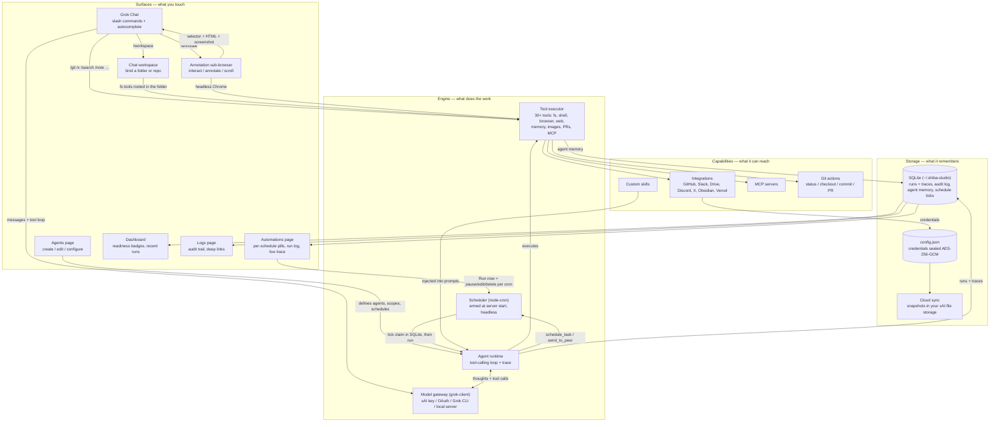

# Architecture — how the features fit together

Every surface in Shiba Studio funnels into the same small engine: one model
gateway, one tool executor, one SQLite store, one audit trail. The diagram
below shows the real interaction paths (GitHub renders it inline).

## Reading the map

- **Everything speaks through one gateway.** Chat turns, agent runs, and
  auto-titling all route through `lib/grok-client` — whichever model source is
  connected (xAI API key, OAuth 2.0 with X, the Grok CLI, or a local
  OpenAI-compatible server). The dashboard's readiness badges report exactly
  these four routes.
- **One tool executor, many callers.** The chat tool loop, agent runs, and
  slash commands all execute through `lib/agent-tool-exec` — so a tool behaves
  identically whether chat called it, a scheduled run called it, or you typed
  a slash command. Cloud-origin agents are blocked from machine tools; a chat
  workspace binding explicitly grants the fs tools for that folder only.
- **The scheduler is process-safe.** Cron arms once at server start
  (`instrumentation.ts`), state is shared across module copies, and every fire
  atomically claims its minute tick in SQLite — duplicate tasks or extra
  server processes skip instead of double-running.
- **Everything lands in the audit log.** Runs, chats, tool calls, config
  changes, git actions, sync — the Logs page reads the same SQLite trail and
  deep-links back into full execution traces.

For file-level details see [Development](development.md); for the data
locations and security model see [Configuration](configuration.md).
